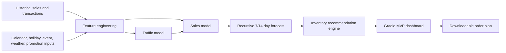

# ShelfSense AI - Phase 3 MVP Report

**Course:** MAE301  
**Team:** Outlier 5  
**Team members:** Gael Barba, Joseph Franco, Kai Jones, Trent Patton

## 1. Executive Summary

ShelfSense is an event-aware grocery forecasting and inventory planning MVP for store managers. The problem is that grocery demand changes sharply around holidays, promotions, payday periods, weather shifts, and local events. If managers rely only on intuition or simple averages, they risk stockouts on high-demand days and waste on slow days.

The Phase 3 MVP turns the Phase 2 forecasting prototype into a usable planning tool. A manager can select a store and product family, choose a 7-day or 14-day planning horizon, enter current stock and service-level assumptions, and receive a forecast plus a recommended order quantity.

The MVP currently does four things:

- predicts store-level transaction traffic
- predicts store and product-family unit sales
- explains likely drivers such as holidays, events, promotions, and heat
- recommends inventory order quantities rounded to case-pack size

## 2. User and Use Case

The target user is a grocery store manager or inventory planner who has to make short-horizon ordering decisions for categories such as beverages, produce, snacks, dairy, bakery, or frozen goods.

Example workflow:

1. The manager selects `S002 / beverages`.
2. The manager chooses a 7-day planning horizon.
3. The manager enters current stock on hand and case-pack size.
4. ShelfSense returns projected demand, expected traffic, likely demand drivers, and an order recommendation.
5. The manager exports the daily order plan for review.

The concrete MVP feature is:

**A grocery manager can select a store and product family, and ShelfSense returns an event-aware demand forecast, a traffic alert, and a recommended inventory order.**

## 3. System Design



The system has three layers:

- Data layer: generated historical sales, transaction counts, store profiles, calendar features, promotions, local events, and weather proxies.
- Model layer: XGBoost regressors for traffic and sales forecasting, compared against baselines.
- Product layer: Gradio dashboard that converts forecasts into manager-facing recommendations.

## 4. Data

The MVP uses a calibrated synthetic Arizona grocery scenario. This choice keeps the project fully reproducible for peer review while matching the Phase 1 proposal more closely than a generic random dataset.

Dataset shape:

- 4 store profiles: Tempe, Phoenix, Mesa, Scottsdale
- 6 product families: produce, beverages, snacks, dairy, bakery, frozen
- 731 historical days from 2024-01-01 to 2025-12-31
- 17,544 sales rows
- 2,924 transaction rows
- 14 future days for the forecast horizon

Features include:

- store and product family
- daily unit sales
- store-level transactions
- holiday flag and holiday name
- local event flag and event name
- promotion flag
- weekend and payday flags
- average temperature and heatwave flag
- lag and rolling demand features

The data pipeline is in `src/generate_synthetic_data.py`. Data notes are documented in `data/data_notes.md`.

Important limitation: this is not yet a raw Favorita/M5 ingestion pipeline. A production version would replace the calibrated synthetic data with real store sales and inventory exports plus public holiday/event APIs.

## 5. Models

ShelfSense uses two supervised regression models:

- Traffic model: predicts daily store-level transactions.
- Sales model: predicts daily unit sales for each store and product family.

Model family:

- XGBoost regressors with numeric and categorical preprocessing
- lag features and rolling averages
- calendar, event, promotion, payday, and weather features

Baselines:

- seasonal naive 7-day lag
- XGBoost without event features
- event-aware XGBoost

Train/test protocol:

- time-based split
- final 56 days held out as the test period
- no random row split, because deployment requires forecasting future dates from past dates

## 6. Evaluation

The event-aware XGBoost model was the strongest model for both targets.

| Target | Best model | WMAPE | MAE | RMSE |
|---|---|---:|---:|---:|
| Sales | Event-aware XGBoost | 0.0674 | 11.82 | 15.97 |
| Transactions | Event-aware XGBoost | 0.0382 | 38.32 | 50.62 |

The ablation result matters because the core product claim is that demand changes around holidays, events, promotions, and weather. The no-event XGBoost model already performs well, but the event-aware model improves accuracy and is especially useful on event and holiday days.

Qualitative assessment:

- Forecast plots show the model tracks short-horizon demand better than the seasonal baseline.
- Manager explanations identify visible drivers such as holidays, promotions, and local event weekends.
- The MVP dashboard gives an operational recommendation, not just a prediction.

## 7. MVP Demo

The runnable MVP is `app.py`. A `demo.py` wrapper is also included for reviewers who expect a demo entrypoint name.

The app includes:

- store selector
- product-family selector
- 7-day or 14-day horizon selector
- current-stock input
- service-level selector
- case-pack input
- KPI cards
- demand and traffic forecast plots
- daily inventory plan
- downloadable CSV export

The demo can be run locally:

```powershell
cd C:\Users\gaelb\Downloads\shelfsenephase2\mvp
powershell -ExecutionPolicy Bypass -File .\run_all.ps1
C:\Users\gaelb\AppData\Local\Programs\Python\Python312\python.exe app.py
```

## 8. Limitations and Risks

The current MVP is useful as a course prototype, but several limitations remain:

- Synthetic data: the model has not yet been validated on a real grocery retailer's raw sales data.
- Event data: local events are deterministic proxy events, not live API records.
- Inventory realism: current stock is entered manually and supplier lead times are simplified.
- Granularity: forecasts are at product-family level, not SKU level.
- Causality: explanations identify likely drivers, but they are not causal proofs.
- Business constraints: perishability, shelf capacity, supplier minimums, and waste costs are simplified.

Privacy risk is low in this prototype because no customer-level data is used.

## 9. Next Steps

With 2-3 more months, the team would prioritize:

- Replace the synthetic scenario with Favorita or M5 public grocery data.
- Add a real holiday/event ingestion layer using Nager.Date, Ticketmaster, or similar APIs.
- Add SKU hierarchy and perishable-item constraints.
- Add prediction intervals and confidence bands.
- Connect recommendations to cost tradeoffs between stockouts and waste.
- Deploy the app permanently through Hugging Face Spaces.
- Run small user tests with students or retail workers acting as proxy store managers.

## 10. Conclusion

Phase 3 delivers a working MVP attempt for the ShelfSense idea. The project now has a reproducible training pipeline, benchmark evidence, forecast artifacts, a usable dashboard, inventory recommendations, and a report that documents the system honestly. The main remaining gap is real retailer data ingestion, but the MVP demonstrates the intended product loop end to end.
